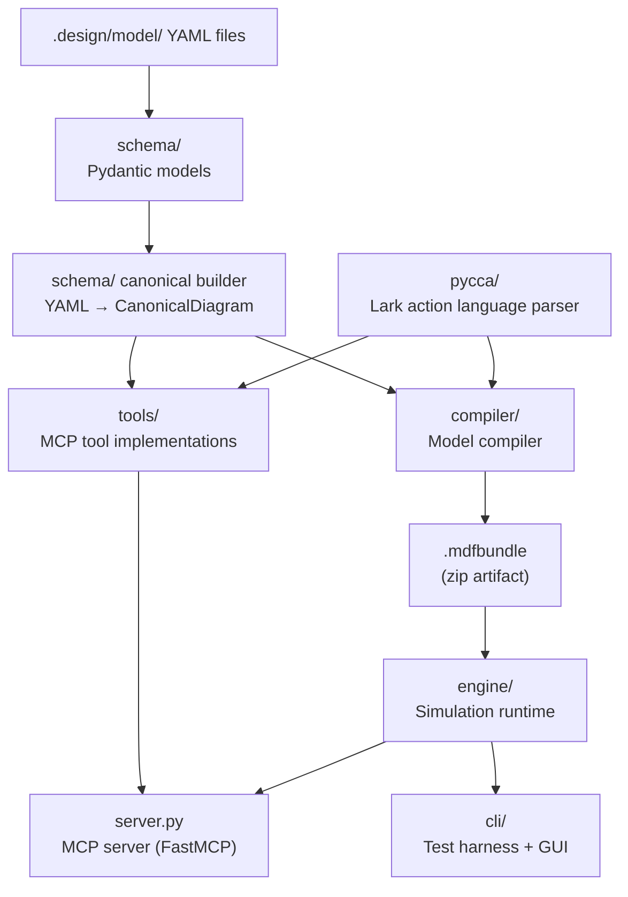

<!-- generated-by: gsd-doc-writer -->
# Architecture

## System Overview

`mdf-sim` is a Python library and MCP server for authoring, validating, and simulating Shlaer-Mellor / Executable UML domain models. The system accepts domain models expressed as YAML files, validates their structural and behavioral correctness, compiles them to a self-contained `.mdfbundle` artifact, and executes simulations using run-to-completion xUML semantics. The primary architectural style is a layered pipeline: a schema layer defines the model grammar, a tools layer exposes model I/O and validation as MCP tools, a compiler layer transforms valid YAML into executable Python, and an engine layer runs the resulting bundles.

---

## Component Diagram



---

## Data Flow

A typical path from model authoring to simulation output:

1. **Author** writes domain YAML files under `.design/model/<Domain>/` (class-diagram.yaml, state-diagrams/*.yaml, optional types.yaml).
2. **MCP tools** (`read_model`, `write_model`, `validate_model`) read and validate YAML through `schema/yaml_schema.py` Pydantic models. Validation also invokes `pycca/grammar.py` to parse guard expressions embedded in state diagrams.
3. **Compiler** (`compiler.compile_model`) walks the model root via `compiler/loader.py`, converts YAML schema objects to canonical form (`schema/canonical_builder.py`), builds a `DomainManifest` TypedDict (`compiler/manifest_builder.py`), generates one Python module per concrete class (`compiler/codegen.py`), and writes a deterministic `.mdfbundle` zip (`compiler/packager.py`).
4. **Engine** (`engine.run_simulation`) accepts the `DomainManifest` plus an optional scenario dict and yields a stream of `MicroStep` records as the scheduler dequeues and dispatches events.
5. **CLI / GUI** (`cli/test_harness.py`, `cli/gui.py`) or the MCP `simulation` tool consume the micro-step stream for test assertions or interactive debugging.

---

## Key Abstractions

| Abstraction | File | Description |
|---|---|---|
| `DomainManifest` | `engine/manifest.py` | TypedDict: runtime-ready view of a domain; holds `class_defs`, `associations`, `generalizations`. |
| `ClassManifest` | `engine/manifest.py` | Per-class TypedDict: identifier attrs, transition table, initial/final/senescent states, super/subtypes. |
| `TransitionEntry` | `engine/manifest.py` | Per-transition TypedDict: `next_state`, `action_fn`, `guard_fn` callables. |
| `SimulationContext` | `engine/ctx.py` | Single API surface that generated action code calls; owns clock, registry, relationships, scheduler, bridges. |
| `run_simulation` | `engine/ctx.py` | Top-level entry point: creates a `SimulationContext`, loads a scenario, yields all `MicroStep` records. |
| `ThreeQueueScheduler` | `engine/scheduler.py` | Priority / standard / delay queue implementation with run-to-completion semantics and polymorphic dispatch. |
| `InstanceRegistry` | `engine/registry.py` | Instance lifecycle store: sync/async create, sync/async delete, attribute and state access. |
| `RelationshipStore` | `engine/relationship.py` | Tracks association links between instances; supports `relate`, `unrelate`, `navigate`. |
| `SimulationClock` | `engine/clock.py` | Simulation time in milliseconds; supports speed multiplier, pause/resume. |
| `BridgeMockRegistry` | `engine/bridge.py` | Maps bridge operation names to mock return values; undefined operations return `None` without raising. |
| `MicroStep` (+ 12 subtypes) | `engine/microstep.py` | Frozen dataclasses emitted by the engine for every observable action (scheduler select, event received, guard evaluated, transition fired, action executed, generate dispatched, event delayed/expired/cancelled, instance created/deleted, bridge called, error). |
| `ClassDiagramFile` / `StateDiagramFile` | `schema/yaml_schema.py` | Pydantic v2 models for YAML file parsing and structural validation. |
| `CanonicalClassDiagram` / `CanonicalStateDiagram` | `schema/drawio_canonical.py` | Intermediate canonical form shared by the Draw.io renderer and compiler. |
| `compile_model` | `compiler/__init__.py` | Pipeline entry: load → build manifest → codegen → package bundle. |

---

## Directory Structure Rationale

```
schema/         Pydantic v2 models for all YAML file types (class diagrams, state
                diagrams, types, domain registry). Also holds the canonical builder
                and Draw.io schema models used by both the tools and compiler layers.

tools/          MCP tool implementations exposed via server.py: model_io (read/write
                YAML), validation (structural + behavioral checks), drawio (render /
                sync diagrams), simulation (thin engine wrapper).

pycca/          Lark-based parser for the MDF action language DSL. Exports
                GUARD_PARSER (guard expressions only) and STATEMENT_PARSER (full
                action blocks). Used by both tools/validation.py and compiler/.

compiler/       Model compiler pipeline. loader.py → manifest_builder.py →
                codegen.py → packager.py. Produces deterministic .mdfbundle zips.
                CONSTRAINT: must not import from engine/.

engine/         Simulation runtime framework. Zero imports from schema/, tools/, or
                pycca/. Consumes DomainManifest TypedDicts produced by compiler/.
                Contains: ctx.py (SimulationContext), scheduler.py, registry.py,
                relationship.py, clock.py, bridge.py, microstep.py, manifest.py,
                event.py.

cli/            CLI test harness (test_harness.py) and GUI debugger (gui.py).
                Entry points: mdf-sim-test, mdf-sim-gui.

server.py       FastMCP server entry point. Registers all MCP tools from tools/.

tests/          pytest suite covering schema, tools, compiler, engine, and elevator
                example model.

examples/       Reference models. elevator/ is a multi-domain elevator control
                system used for integration testing and validation baselines.

.design/model/  Runtime model root for the active project. Domain YAML files live
                here and are read by tools/ at runtime.
```

---

## Architectural Constraints

- **D-37 / SC-11:** `engine/` has zero imports from `schema/`, `tools/`, or `pycca/`. It consumes only `DomainManifest` TypedDicts produced by `compiler/`.
- **D-11:** `compiler/` must not import from `engine/`. The compiler produces bundles that the engine loads; they communicate only through the `.mdfbundle` artifact and the `DomainManifest` TypedDict shape.
- **Run-to-completion:** The scheduler enforces that one event processes fully — including all generated events enqueued — before the next event is selected.
- **Deterministic bundles:** `compiler/packager.py` writes zip entries in sorted order with a fixed timestamp (`(2020, 1, 1, 0, 0, 0)`) so bundle bytes are stable across builds for the same model.
- **No raises in MCP tools:** All tool functions return structured issue dicts and never raise; errors surface as list entries with `issue`, `location`, `value`, `fix`, and `severity` fields.
